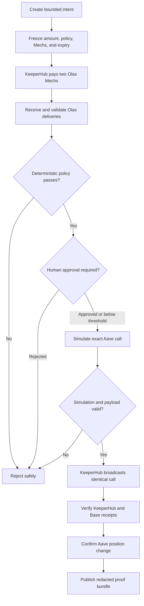
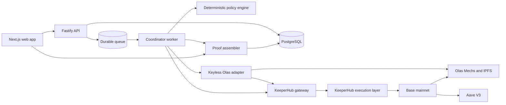

# Synesis

**Paid intelligence. Proven execution.**

Synesis is a safety and coordination layer for agent-controlled onchain value.
It collects independent analysis from Olas Mech agents, evaluates their
responses with deterministic policy, and gives KeeperHub one exact, bounded
transaction to simulate, execute, monitor, and prove.

The first supported journey asks two independent Mechs whether a bounded USDC
supply into Aave V3 is acceptable. Value can move on Base only when their
responses are valid, fresh, consistent, inside policy limits, and approved when
required.

[Open Synesis](https://synesis-web.vercel.app/) ·
[Backend health](https://synesis-web.vercel.app/api/v1/status) ·
[Verify PRF-1041](https://synesis-web.vercel.app/verify/PRF-1041) ·
[Architecture](docs/ARCHITECTURE.md)

> [!NOTE]
> The public deployment runs in clearly labelled **DEMO / NO VALUE** mode so
> anyone can explore every product surface safely. Live mode activates the
> credential, authentication, readiness, persistence, and execution gates
> described below; it never silently substitutes demo data for a failed live
> dependency.

## Why Synesis exists

AI agents are useful decision makers, but they are probabilistic. Onchain
transactions are not: an incorrect address, amount, retry, or piece of calldata
can permanently move value.

A treasury that lets one model directly control a wallet inherits several
problems:

- the model can hallucinate or use stale information;
- repeated prompts can produce different answers;
- untrusted output can contain unsafe instructions or addresses;
- a retry can perform the same economic action twice;
- an HTTP response can be mistaken for onchain success;
- users may be unable to reconstruct why a transaction was authorized.

Synesis separates the responsibilities:

| Responsibility                        | Owner                 | Guarantee                                                        |
| ------------------------------------- | --------------------- | ---------------------------------------------------------------- |
| Produce independent analysis          | Olas Mechs            | Agents provide evidence, not transaction instructions            |
| Decide whether evidence is sufficient | Synesis policy engine | Versioned rules return the same result for the same inputs       |
| Land the transaction reliably         | KeeperHub             | Simulation, signing, idempotency, recovery, receipts, and audit  |
| Prove what happened                   | Synesis proof system  | Intent, evidence, policy, execution, and outcome are hash-linked |

The central rule is:

> **Agents recommend. Policy authorizes. KeeperHub executes. Receipts prove.**

## Terms in plain language

- **Intent:** a bounded request containing the objective, maximum amount,
  strategy, network, policy, eligible agents, and expiry.
- **Olas Mech:** an independent agent service paid to perform a defined analysis
  task.
- **Quorum:** the minimum compatible agent evidence required before an action
  can be authorized.
- **Policy:** immutable deterministic rules that validate evidence, enforce
  limits, and decide whether execution may continue.
- **KeeperHub:** the only Synesis boundary permitted to sign and broadcast a
  value-moving transaction.
- **Proof bundle:** canonical JSON connecting the frozen intent, agent evidence,
  policy result, simulation, receipts, and observed outcome.

## How Synesis works



The initial intent is equivalent to:

> Supply at most this amount of USDC into this allowlisted Aave V3 Pool on Base,
> for this KeeperHub wallet, only if two independent Mechs return fresh,
> compatible recommendations and every policy rule passes.

The agents never choose the contract, recipient, function selector, or amount.
Those values come from the frozen intent and a pinned deployment manifest.

## What can be done in the product

Synesis is a connected multipage application rather than a single presentation
screen.

| Route                        | Surface                   | Purpose and interaction                                                                               |
| ---------------------------- | ------------------------- | ----------------------------------------------------------------------------------------------------- |
| `/`                          | Product site              | Understand Synesis, its integrations, and safety model                                                |
| `/app`                       | Command center            | Review active intents, treasury information, integration status, proofs, and activity                 |
| `/app/intents`               | Intent library            | Browse decision lifecycles and open their evidence rooms                                              |
| `/app/intents/new`           | Intent composer           | Enter a bounded amount and expiry, choose two eligible Mechs, review exposure, and freeze the request |
| `/app/intents/[id]`          | Intent Room               | Follow the lifecycle, simulate the exact call, approve, reject, cancel, and open proof evidence       |
| `/app/mechs`                 | Mech marketplace          | Compare providers, tools, price, delivery history, compatibility, and eligibility                     |
| `/app/mechs/[address]`       | Mech profile              | Inspect identity, metadata, schemas, performance, and eligibility reasons                             |
| `/app/policies`              | Policy library            | Review immutable policy versions, quorum rules, approval mode, and limits                             |
| `/app/policies/[id]`         | Policy detail             | Compare readable rules with canonical policy data and its hash                                        |
| `/app/executions`            | Execution ledger          | Filter simulations, confirmations, rejections, failures, and unresolved writes                        |
| `/app/executions/[id]`       | Execution detail          | Inspect calls, payload hashes, KeeperHub status, receipts, retries, and explorer references           |
| `/app/treasury`              | Treasury                  | Review balances, procurement spend, strategy exposure, and policy capacity                            |
| `/app/proofs`                | Proof library             | Find evidence bundles and open verification pages                                                     |
| `/verify/[proofId]`          | Public verifier           | Recompute hashes and the proof root, then download canonical JSON                                     |
| `/app/settings/integrations` | Integration control plane | Check KeeperHub, Base, Olas, IPFS, webhook, and session readiness                                     |
| `/app/settings/security`     | Security controls         | Inspect access controls and engage or clear the emergency pause                                       |

The app also includes responsive navigation, a keyboard command palette,
activity drawer, loading and error boundaries, and links between related
intents, agents, policies, executions, and proofs.

## Example journey

Suppose a treasury has idle USDC. An operator creates this intent:

> Supply 1 USDC into Aave V3 on Base if two independent agents agree that the
> protocol and market risk are acceptable.

Synesis then:

1. freezes the exact amount, chain, asset, contracts, policy, Mechs, and expiry;
2. uses KeeperHub to pay each Mech for independent analysis;
3. waits for confirmed Olas deliveries and validates their schemas and hashes;
4. rejects mismatched, malformed, stale, or incompatible evidence;
5. applies deterministic confidence, risk, quorum, allowlist, and spending rules;
6. requests human approval when the active policy requires it;
7. builds a bounded USDC approval and Aave supply plan;
8. simulates the call and binds the accepted payload hash to broadcast;
9. submits through KeeperHub with stable economic idempotency;
10. verifies the KeeperHub receipt, Base receipt, and Aave position delta;
11. publishes proof connecting the decision to the observed state change.

If agents disagree, evidence expires, a policy limit fails, or simulation
reverts, Synesis stops. It does not invent an alternative transaction.

## Deterministic policy

The policy engine has no network access and performs no LLM calls. Initial
authorization requires:

- two distinct eligible Mech addresses;
- responses matching the frozen request, chain, and asset;
- compatible `SUPPLY` recommendations;
- confidence of at least 7,000 basis points;
- median risk at or below the configured threshold;
- disagreement inside the permitted tolerance;
- fresh responses and underlying evidence;
- an amount below both intent and treasury caps;
- allowlisted token, Aave Pool, recipient, ABI, and selector;
- no prior successful execution for the same economic intent.

Every rule and result becomes proof evidence. A failed rule produces a visible
rejection, never a substitute action.

## Proof, not promises

A production proof bundle is designed to include:

- Synesis intent and trace identifiers;
- frozen prompt, policy, Mech metadata, tool-schema, ABI, and manifest hashes;
- IPFS request CIDs and delivered-result hashes;
- Olas request IDs, Mech addresses, payments, and delivery events;
- every deterministic policy rule and its outcome;
- KeeperHub simulation and execution IDs;
- payload hashes, transaction hashes, and verified receipts;
- Aave before-and-after position reads;
- replay evidence demonstrating idempotent behavior;
- an ordered root hash over all canonical evidence entries.

The public verifier recomputes hashes instead of trusting an API-provided label.
Credentials, private organization data, and secret-bearing responses are
redacted before publication.

[PRF-1041](https://synesis-web.vercel.app/verify/PRF-1041) demonstrates the
public verification experience and downloadable canonical JSON.

## Demo and live modes

| Capability                | Public demo                          | Authorized live mode                                      |
| ------------------------- | ------------------------------------ | --------------------------------------------------------- |
| Multipage application     | Fully interactive                    | Interactive with OIDC and role checks                     |
| Mech directory            | Deterministic snapshot               | Olas contracts, subgraph, metadata, and schema validation |
| Intent creation           | Deployed Vercel backend-for-frontend | Persisted Fastify API and PostgreSQL lifecycle            |
| Approval and cancellation | Interactive and idempotent           | Authenticated, audited, idempotent commands               |
| Simulation                | Exact-call demonstration boundary    | KeeperHub direct contract-call simulation                 |
| Broadcast                 | Disabled by the demo guard           | KeeperHub-only after readiness and approval gates         |
| Proof                     | Canonical verification example       | Olas, KeeperHub, Base, and Aave evidence                  |
| Emergency pause           | Interactive control                  | Checked immediately before every live write               |

Live mode requires explicit acknowledgement, rotated credentials, a funded
low-value KeeperHub organization wallet, private Base RPC access, managed
PostgreSQL and Redis, and long-running coordinator and adapter services.

## Architecture



### Main components

- **Web:** Next.js application and public demo backend-for-frontend.
- **API:** typed Fastify service for authentication, validation, intents,
  approvals, integration setup, and read models.
- **Coordinator:** durable worker that advances the state machine and reconciles
  ambiguous external outcomes.
- **Olas adapter:** isolated Python service using the official Mech Client for
  discovery, request envelopes, payment rules, and delivery normalization. It
  cannot sign transactions.
- **KeeperHub gateway:** the only write boundary; it enforces allowlists,
  manifests, idempotency, simulation binding, polling, and receipt validation.
- **Policy engine:** deterministic, versioned, and free of model or network I/O.
- **Proof kit:** canonical JSON, hashing, redaction, root construction, and
  independent verification.

Read [ARCHITECTURE.md](docs/ARCHITECTURE.md) for the complete state machine,
data model, trust boundaries, APIs, topology, and recovery design.

## Security and reliability

### Transaction controls

- KeeperHub is the only signing and broadcasting path.
- Synesis stores no wallet private keys.
- Live v1 enforces Base chain ID `8453`.
- Contracts, bytecode hashes, ABIs, selectors, recipients, and amounts are
  allowlisted and capped.
- Token approvals are exact or tightly bounded; unlimited approval is forbidden.
- Broadcast must match the approved simulation payload hash.
- Emergency pause is checked immediately before every write.

### Agent-output controls

- Mech responses must satisfy strict versioned JSON Schema.
- Agent text, URLs, code, calldata, amounts, and addresses are untrusted.
- Transaction parameters come from the frozen intent, not Mech output.
- Wrong request IDs, networks, assets, versions, and expired responses are
  rejected.
- IPFS objects are content-addressed and size limited.

### Failure and replay controls

- Stable idempotency identifies economic work rather than retry attempts.
- Unique constraints prevent duplicate procurement and execution.
- Duplicate webhooks and chain events enter one deduplicating inbox.
- An unconfirmed execution freezes the intent and reconciles the same execution
  instead of submitting another one.
- Success requires KeeperHub verification, independent Base agreement, and the
  intended protocol state delta.
- Reorgs, stale evidence, disagreement, simulation failure, and policy
  violations stop execution safely.

Detailed specifications:

- [KeeperHub safe execution](docs/KEEPERHUB_SAFE_EXECUTION.md)
- [receipt verification](docs/KEEPERHUB_RECEIPT_VERIFICATION.md)
- [Base deployment manifest](docs/DEPLOYMENT_MANIFEST.md)
- [integration onboarding](docs/INTEGRATION_ONBOARDING.md)
- [security model](docs/SECURITY.md)

## Ecosystem integrations

| Project   | Role in Synesis                                                             |
| --------- | --------------------------------------------------------------------------- |
| KeeperHub | Exclusive simulation, signing, execution, recovery, and audit layer         |
| Olas      | Agent discovery, paid Mech requests, delivery evidence, and recommendations |
| Aave V3   | Bounded strategy target receiving the approved USDC supply                  |
| Base      | Settlement network and independently queried source of receipt truth        |

## Hackathon judging alignment

| Criterion                        | How Synesis addresses it                                                                                    |
| -------------------------------- | ----------------------------------------------------------------------------------------------------------- |
| Integration depth                | Olas identities, tools, paid requests, delivery events, and Aave-specific execution are first-class records |
| KeeperHub execution              | Olas payments and strategy writes pass through the guarded KeeperHub boundary                               |
| Reliability and observability    | Durable state, idempotency, reconciliation, simulation binding, events, and receipt verification            |
| Usefulness and originality       | Multiple paid agents can advise a treasury without controlling signing authority or calldata                |
| Developer experience and quality | Typed monorepo, strict schemas, manifests, tests, runbooks, and reproducible proofs                         |

## Judge walkthrough

1. Open the [command center](https://synesis-web.vercel.app/app) and confirm the
   backend-connected indicator.
2. Open the Mech marketplace and compare the independent providers.
3. Create a bounded intent, select exactly two Mechs, inspect maximum exposure,
   and freeze the request.
4. In the generated Intent Room, simulate the exact call and record an
   idempotent approval.
5. Inspect policy rules, execution evidence, treasury limits, integration
   health, and emergency pause.
6. Open PRF-1041, independently verify it, and download canonical JSON.

The four-minute presentation flow is in [DEMO_SCRIPT.md](docs/DEMO_SCRIPT.md).

## Repository layout

```text
Synesis/
├── apps/
│   ├── web/                  # Next.js product and Vercel demo BFF
│   ├── api/                  # Fastify application API
│   └── worker/               # durable coordinator and reconcilers
├── services/
│   └── olas-adapter/         # keyless Python Mech Client boundary
├── packages/
│   ├── database/             # schema, migrations, and repositories
│   ├── domain/               # entities, state machine, and schemas
│   ├── keeperhub-client/     # execution and receipt recovery
│   ├── observability/        # traces, logs, and metrics
│   ├── olas-contracts/       # pinned manifests and ABIs
│   ├── policy-engine/        # deterministic authorization rules
│   ├── proof-kit/            # canonical evidence and verification
│   ├── queue/                # durable jobs and retry policy
│   └── ui/                   # shared accessible components
├── deploy/                   # container and Compose topology
├── docs/                     # architecture, security, runbooks, and demo
└── scripts/                  # acceptance automation
```

## Local development

### Prerequisites

- Node.js 24 or newer
- Corepack and pnpm 10
- Python 3.11 and `uv` for the Olas adapter
- Docker for the full local topology

Install and start the workspace:

```powershell
corepack pnpm install --frozen-lockfile
corepack pnpm dev
```

| Service      | Default URL             |
| ------------ | ----------------------- |
| Web          | `http://localhost:3000` |
| API          | `http://localhost:4000` |
| Olas adapter | `http://localhost:8100` |

Safe demo defaults require no live credentials. Copy `.env.example` only when
an override is needed, and never commit a populated `.env` file.

Start the complete container topology with:

```powershell
Copy-Item deploy/.env.example .env
docker compose -f deploy/compose.yaml up --build
```

See [deploy/README.md](deploy/README.md) for migrations, managed services,
private networking, backups, health checks, and rollback.

## Testing

Run all Node quality gates:

```powershell
corepack pnpm format:check
corepack pnpm lint
corepack pnpm typecheck
corepack pnpm test
corepack pnpm build
```

Check the Python adapter:

```powershell
Set-Location services/olas-adapter
uv sync --locked --all-extras --dev
uv run ruff check .
uv run ruff format --check .
uv run mypy src tests
uv run pytest
```

Tests cover state transitions, policy boundaries, hashing, calldata allowlists,
idempotency, KeeperHub responses, receipt classification, Olas validation,
webhook replay rejection, persistence, recovery, and browser journeys.

## Live acceptance

The authorized acceptance run is separate from CI. It requires rotated
KeeperHub credentials, a funded low-value organization wallet, private Base RPC
access, deployed long-running services, and explicit acknowledgement:

```powershell
$env:SYNESIS_MODE = "live"
$env:SYNESIS_LIVE_ACKNOWLEDGED = "I_UNDERSTAND_LIVE_VALUE_MOVEMENT"
$env:SYNESIS_API_ORIGIN = "https://api.example.com"
$env:SYNESIS_ACCEPTANCE_REPORT = "./acceptance-report.json"
corepack pnpm acceptance:live
```

The validator requires:

1. two paid Olas requests through KeeperHub;
2. two verified Olas deliveries;
3. a passing deterministic quorum report;
4. bounded Aave V3 USDC execution through KeeperHub;
5. verified successful receipts for all value-moving transactions;
6. an independently observed Aave position increase;
7. a downloadable public proof;
8. a replay attempt that moves no additional value.

The runner never invents receipts and is not an ad-hoc broadcaster. Read
[LIVE_ACCEPTANCE.md](docs/LIVE_ACCEPTANCE.md) before enabling live mode.

## Deliberate scope

- Base mainnet, USDC, two Mechs, and Aave V3 supply form the live v1 boundary.
- The Vercel backend serves the interactive public experience; durable live
  coordination requires the API, worker, database, queue, and Olas adapter.
- Arbitrary contract calls, leverage, unbounded swaps, multi-chain settlement,
  and agent-supplied calldata are out of scope.
- Higher-risk execution requires explicit human approval.

These constraints make the first value loop understandable, testable, and safe.

## Documentation

- [Complete architecture](docs/ARCHITECTURE.md)
- [Epic implementation status](docs/EPIC_STATUS.md)
- [Integration onboarding](docs/INTEGRATION_ONBOARDING.md)
- [KeeperHub safe execution](docs/KEEPERHUB_SAFE_EXECUTION.md)
- [KeeperHub receipt verification](docs/KEEPERHUB_RECEIPT_VERIFICATION.md)
- [Deployment manifest](docs/DEPLOYMENT_MANIFEST.md)
- [Live acceptance](docs/LIVE_ACCEPTANCE.md)
- [Judge demo script](docs/DEMO_SCRIPT.md)
- [Submission checklist](docs/SUBMISSION_CHECKLIST.md)
- [Deployment guide](deploy/README.md)
- [Olas adapter](services/olas-adapter/README.md)

## Definition of done

Synesis is not complete merely because a page renders or an API returns a
transaction hash. The complete value loop lets a user inspect agents, create a
bounded intent, procure independent intelligence through KeeperHub, receive
confirmed evidence, see a deterministic decision, execute the approved action,
and independently verify the entire path.

**Paid intelligence. Deterministic authorization. Proven execution.**
