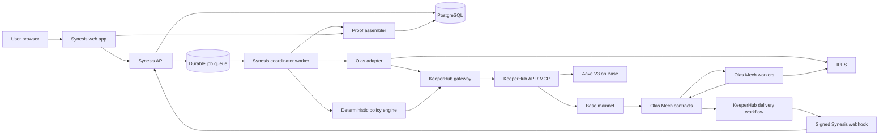
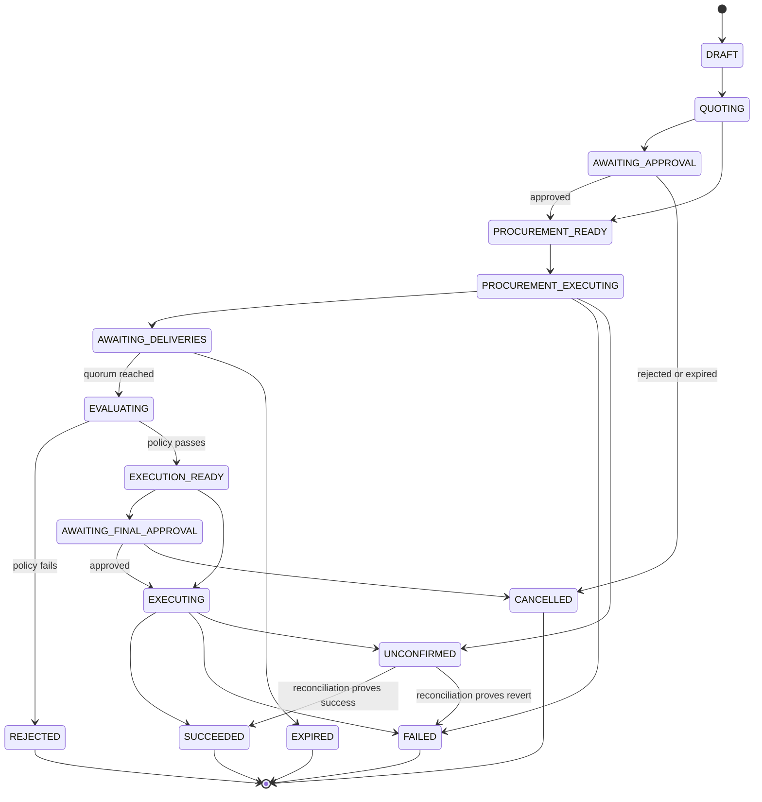

# Synesis Architecture

**Status:** Approved design baseline  
**Version:** 1.0  
**Date:** 2026-09-14  
**Tagline:** Paid intelligence. Proven execution.

## 1. Product definition

Synesis is a production-shaped agent procurement and execution platform. A user creates an onchain intent, Synesis pays live Olas Mech agents for independent analysis, and a deterministic policy decides whether the returned evidence is sufficient to unlock an onchain action. KeeperHub simulates, submits, monitors, and proves every transaction.

The first complete product journey is deliberately narrow:

> Ask two Olas Mechs whether a bounded USDC supply action is acceptable, require quorum and freshness, then use KeeperHub to supply that USDC to Aave V3 on Base.

This is the first strategy, not the limit of the platform. The domain model supports additional external agents, policies, and execution targets without weakening the safety boundary.

### What makes the product real

- Live mode talks to Olas, IPFS, KeeperHub, Base, and Aave. It never substitutes mock transactions.
- Every value-moving call is sent by KeeperHub's organization wallet, not by a private key stored in Synesis.
- Every decision references immutable input, policy, response, simulation, execution, and receipt hashes.
- Duplicate jobs, events, webhooks, and retries cannot intentionally create duplicate economic actions.
- Users can inspect and stop the lifecycle before value moves.
- Demo mode is clearly labelled and stored separately from live evidence. It exists for onboarding and UI testing, not for submission proof.

## 2. Design principles

1. **Agents produce evidence; policies authorize actions.** Free-form model output never directly becomes transaction calldata.
2. **KeeperHub is the only write path.** Synesis and the Olas adapter prepare calls but do not hold a transaction-signing private key.
3. **Simulate the exact call before broadcast.** The simulation payload is hashed and compared with the broadcast payload.
4. **Receipts, not HTTP acceptance, prove success.** A job succeeds only when KeeperHub reports a verified receipt with `receiptStatus: success`.
5. **At-least-once delivery, exactly-once economic intent.** Workers may retry; idempotency and database constraints prevent logical re-execution.
6. **Everything important is versioned.** Policies, prompts, Mech/tool metadata, ABIs, contract allowlists, and execution plans are immutable once used.
7. **Human control scales with risk.** Policies can auto-approve small bounded actions and require explicit approval above a threshold.
8. **No invisible fallback.** A failed live integration is shown as failed or unconfirmed; it never silently falls back to simulated data.

## 3. Scope

### Version 1

- Base mainnet only for the live Olas-to-Aave journey.
- USDC as procurement and strategy asset.
- Olas onchain client mode using the KeeperHub organization EOA as payer.
- Two independent Mech requests with configurable quorum.
- One supported decision schema: `SUPPLY` or `HOLD`, confidence, risk score, evidence, and expiry.
- One execution strategy: approve USDC and supply it to Aave V3 on behalf of the KeeperHub wallet.
- Saved KeeperHub workflow for Olas delivery-event notification.
- Direct KeeperHub contract calls for exact simulation and write execution.
- Public, redacted proof pages.

### Explicitly deferred

- Arbitrary user-written contract calls.
- Leveraged borrowing, perpetual trading, or unbounded swaps.
- Olas Safe/agent mode and offchain signing; these require signing capabilities outside the v1 boundary.
- Multi-chain settlement.
- Automatic strategy execution above the configured low-value limit.
- User-created code in the policy engine.

## 4. System context



### Trust boundaries

- **Untrusted:** browser input, Mech text, IPFS content, webhook payloads, public RPC responses.
- **Conditionally trusted:** Olas contract events after confirmation and contract allowlist validation.
- **Execution authority:** KeeperHub organization wallet and its configured spending limits.
- **Authorization authority:** versioned Synesis policy plus any required user approval.
- **Source of transaction truth:** independently checked onchain receipt correlated with KeeperHub's verified receipt.

## 5. Major components

### 5.1 Web application

A Next.js App Router application provides the product UI and a thin backend-for-frontend. It never receives a wallet private key. Live updates use server-sent events with polling as a fallback.

### 5.2 API service

A typed Fastify service owns authentication, validation, intent creation, approvals, integration setup, and read APIs. It writes commands to the durable queue rather than performing long-running blockchain work inside an HTTP request.

### 5.3 Coordinator worker

The coordinator advances intents through a persisted state machine. Each transition runs in a database transaction, records an audit event, and schedules the next durable job.

### 5.4 Olas adapter

The adapter reuses the official Python `mech-client` for discovery, payment rules, IPFS request envelopes, and delivery interpretation. It runs without a local private key.

For v1, its external signer adapter sends each unsigned transaction to the internal KeeperHub gateway. The gateway:

1. checks chain ID, target address, value, and selector against an immutable allowlist;
2. selects the pinned ABI for the target;
3. decodes raw calldata into one exact ABI function and arguments;
4. supplies KeeperHub with an ABI containing only that function, preventing overload ambiguity;
5. simulates or broadcasts through `POST /api/execute/contract-call`;
6. returns the KeeperHub execution ID and verified receipt data to the Olas adapter.

Raw calldata is never forwarded to an independent signer. `sign_message` is disabled in v1, which intentionally disables Olas modes that require it.

The adapter supports both current marketplace and legacy Mech contract shapes. A discovery health check selects only a live, allowlisted Base Mech with a compatible tool schema. Contract addresses are loaded from a versioned deployment manifest and checked onchain at startup; they are not copied from an old README at runtime.

### 5.5 KeeperHub gateway

This is the only component allowed to call KeeperHub write endpoints. Responsibilities:

- attach the scoped organization API key;
- enforce Base-only routing and target/function allowlists;
- perform the exact simulate/broadcast sequence;
- derive stable `Idempotency-Key` values from Synesis economic intent IDs;
- honor rate limits and `X-Poll-Interval-Hint`;
- reconcile completed, failed, and unconfirmed executions;
- validate `verified: true` and `receiptStatus: success`;
- store redacted request/response evidence and hashes.

The gateway does not treat `202 Accepted`, a transaction hash, or KeeperHub `status: completed` alone as success.

### 5.6 KeeperHub delivery workflow

During integration setup, Synesis uses KeeperHub MCP to create and validate a saved workflow:

```text
Olas delivery event on Base
  -> decode and select request ID / delivery hash
  -> send signed HTTP webhook to Synesis
```

This makes the live Olas project the trigger for a KeeperHub workflow. A reconciliation worker also scans confirmed Olas events so a temporary webhook failure cannot strand an intent. Both paths enter the same idempotent event inbox.

### 5.7 Deterministic policy engine

The engine accepts normalized recommendations and a frozen policy version. It has no network access and performs no LLM calls.

The initial decision schema is:

```json
{
  "schemaVersion": "1.0",
  "requestId": "string",
  "action": "SUPPLY | HOLD",
  "asset": "USDC",
  "chainId": 8453,
  "riskScore": 0,
  "confidenceBps": 0,
  "validUntil": "ISO-8601 timestamp",
  "evidence": [{ "claim": "string", "source": "https URL" }],
  "reasoningSummary": "string"
}
```

Default authorization rules:

- at least two distinct Mech addresses delivered valid responses;
- every accepted response matches the frozen request and chain;
- both responses recommend `SUPPLY`;
- each confidence is at least 7,000 basis points;
- median risk score is at or below 35;
- no risk-score difference exceeds 20 points;
- every response and underlying quote is unexpired;
- proposed amount is at or below both the intent cap and policy cap;
- asset, Aave pool, recipient, and function selector are allowlisted;
- the intent has not previously produced a successful economic execution.

Any failed rule produces `REJECTED`, not an alternate transaction.

### 5.8 Proof assembler

The proof assembler creates a canonical JSON evidence package and public verification view. It includes:

- Synesis intent ID and trace ID;
- hashes of the frozen prompt, policy, Mech metadata, tool schema, and ABIs;
- IPFS request CIDs and delivered-result hashes;
- Olas request IDs, Mech addresses, transaction hashes, and delivery events;
- KeeperHub execution IDs, simulation results, transaction hashes, and verified receipts;
- policy evaluation with every rule and result;
- Aave before/after position reads;
- a Merkle-style root hash over the ordered evidence entries.

Secrets, full API responses containing credentials, and private user data are never placed on the public proof page.

## 6. Multi-page product experience

| Route | Page | Purpose and interaction |
|---|---|---|
| `/` | Product site | Explains Synesis, displays a verified example, and links to the app. |
| `/app` | Command center | Portfolio balance, active intents, pending approvals, recent executions, integration health, and proof count. |
| `/app/intents` | Intents | Filterable list of all decision lifecycles and their current states. |
| `/app/intents/new` | New intent wizard | Select strategy, amount, Mechs, policy, expiry, and review the maximum possible spend. |
| `/app/intents/[id]` | Intent room | Live timeline from quote through Olas delivery, quorum, simulation, execution, and proof. Primary demo screen. |
| `/app/mechs` | Mech marketplace | Live discovered Olas Mechs, tools, payment types, price, delivery history, and compatibility status. |
| `/app/mechs/[address]` | Mech profile | Onchain identity, supported tools, schema, recent deliveries, and why it is or is not eligible. |
| `/app/policies` | Policies | List immutable versions, active policy, spend caps, quorum settings, and approval mode. |
| `/app/policies/[id]` | Policy detail | Human-readable rules beside canonical JSON and content hash. |
| `/app/executions` | Execution ledger | All KeeperHub simulations and broadcasts with filters for success, rejection, failure, and unconfirmed. |
| `/app/executions/[id]` | Execution detail | Exact call, simulation, KeeperHub status, receipts, decoded logs, retry history, and explorer links. |
| `/app/treasury` | Treasury | KeeperHub wallet address, Base ETH/USDC balances, Olas prepaid balance, Aave USDC position, and capped exposure. |
| `/app/proofs` | Proof library | Searchable proof bundles and export controls. |
| `/verify/[proofId]` | Public verifier | Redacted, shareable verification page that recalculates evidence hashes. |
| `/app/settings/integrations` | Integrations | KeeperHub, Olas, RPC, IPFS and webhook health checks. |
| `/app/settings/security` | Security | Contract allowlists, limits, approval thresholds, emergency pause, and active sessions. |

### Shared navigation behavior

- An intent ID links the Intent Room, related executions, selected Mechs, policy version, and proof.
- A global activity drawer streams state changes across pages.
- The environment badge is always visible: `LIVE / BASE MAINNET` or `DEMO / NO VALUE`.
- Every live transaction link opens the corresponding explorer; every KeeperHub execution links to its Synesis receipt view.

## 7. End-to-end lifecycle

### 7.1 Onboarding

1. User creates a Synesis account.
2. User provides a KeeperHub organization API key through a server-only form.
3. Synesis verifies the key, scopes, organization wallet address, Base availability, and current limits.
4. Synesis checks ETH and USDC balances without moving funds.
5. Synesis discovers Olas Base deployments and eligible Mechs.
6. Synesis creates or verifies the KeeperHub Olas-delivery workflow through MCP.
7. Synesis sends a signed test webhook with no onchain write.
8. Integration status becomes `READY` only when every health check passes.

### 7.2 Create and freeze an intent

1. User chooses `Aave USDC Supply`, amount, two Mechs, policy, and expiry.
2. API reads current Mech tool schemas, payment types, prices, and relevant Aave state.
3. Synesis displays the maximum procurement spend and maximum strategy amount.
4. On confirmation, the system creates an immutable intent snapshot and content hash.
5. If the total is above the policy's manual threshold, the intent waits for explicit approval.

### 7.3 Procure Mech intelligence through KeeperHub

For each selected Mech:

1. Olas adapter constructs and uploads the prompt/tool envelope to IPFS.
2. It prepares any required USDC approval and Olas request calls.
3. KeeperHub gateway simulates each exact call from the KeeperHub wallet.
4. Synesis compares the simulation call hash with the frozen call hash.
5. KeeperHub broadcasts using an idempotency key such as `synesis:{intentId}:olas:{mech}:request`.
6. The worker polls KeeperHub until a terminal status.
7. Synesis accepts success only with a verified successful receipt, then extracts the Olas request ID from the confirmed event.

### 7.4 Receive results

1. A Mech processes the IPFS request and commits a delivery through Olas.
2. The Olas delivery event starts the saved KeeperHub workflow.
3. KeeperHub posts the request ID, delivery reference, block, and transaction hash to Synesis.
4. Synesis validates the webhook signature and inserts the event into a unique inbox.
5. After the confirmation threshold, the Olas adapter fetches the result from IPFS.
6. Synesis checks CID/hash integrity, size, content type, strict JSON schema, request binding, and freshness.
7. The normalized response is stored immutably. Raw free-form content is treated as data and never executed.

### 7.5 Reach quorum

1. When the minimum delivery count is reached, the coordinator loads the frozen policy.
2. The policy engine evaluates every rule and emits a complete rule-by-rule report.
3. Failure moves the intent to `REJECTED` and generates a proof without moving strategy capital.
4. Success creates a frozen Aave execution plan containing token, amount, pool, recipient, chain, ABI version, and expiry.
5. A final human approval is requested if required by policy.

### 7.6 Execute Aave action through KeeperHub

1. Read current USDC balance, allowance, Aave position, and pool address.
2. If required, simulate and execute a bounded USDC approval through KeeperHub.
3. Simulate the exact Aave `supply` call through KeeperHub contract-call.
4. Recheck expiry, balance, policy version, emergency pause, and successful-execution uniqueness.
5. Broadcast the unchanged call using `synesis:{intentId}:aave:supply`.
6. Poll KeeperHub and independently read the Base receipt.
7. Confirm the Aave position increased by the expected bounded amount.
8. Mark the intent `SUCCEEDED` only after all three proofs agree: KeeperHub receipt, chain receipt, and Aave state delta.

### 7.7 Publish proof

1. Assemble ordered evidence entries.
2. Calculate entry hashes and the proof root.
3. Redact non-public fields.
4. Store immutable proof JSON and render `/verify/[proofId]`.
5. Offer JSON download plus direct BaseScan and KeeperHub identifiers for the hackathon submission.

## 8. Intent state machine



Terminal states are immutable. `UNCONFIRMED` is not automatically retried because a transaction may already have landed.

## 9. Data model

| Entity | Important fields |
|---|---|
| `users` | id, email, auth provider, status, created_at |
| `organizations` | id, name, environment, paused_at |
| `memberships` | organization_id, user_id, role |
| `integration_connections` | organization_id, type, encrypted_secret_ref, health, checked_at |
| `wallet_snapshots` | wallet, chain_id, ETH/USDC balances, block_number, captured_at |
| `mechs` | chain_id, address, service_id, payment_type, metadata_cid, status |
| `mech_tool_versions` | mech_id, tool_id, input_schema, output_schema, schema_hash, observed_at |
| `policy_versions` | organization_id, name, version, canonical_json, content_hash, activated_at |
| `intents` | id, organization_id, state, strategy, amount, chain_id, snapshot_hash, expires_at |
| `intent_mechs` | intent_id, mech_id, tool_version_id, quoted_price, request_cid |
| `olas_requests` | intent_mech_id, request_id, kh_execution_id, tx_hash, state |
| `deliveries` | olas_request_id, event_key, block_number, tx_hash, result_cid, result_hash |
| `recommendations` | delivery_id, normalized_json, validation_status, content_hash |
| `policy_evaluations` | intent_id, policy_version_id, input_hash, result, rule_results, output_hash |
| `execution_plans` | intent_id, target, function, args, ABI hash, value, plan_hash, expires_at |
| `keeperhub_executions` | purpose, idempotency_key, execution_id, simulation_hash, status |
| `transaction_receipts` | kh_execution_id, tx_hash, block_number, receipt_status, verified, raw_hash |
| `event_inbox` | source, event_key, payload_hash, status; unique(source, event_key) |
| `audit_events` | organization_id, actor, action, entity, before_hash, after_hash, trace_id |
| `proof_bundles` | intent_id, public_id, canonical_json, root_hash, created_at |

Economic uniqueness constraints include:

- unique `keeperhub_executions.idempotency_key`;
- unique successful execution per `(intent_id, purpose)`;
- unique Olas `(chain_id, request_id)`;
- unique event `(source, event_key)`;
- one terminal state transition per intent version.

## 10. Application APIs

### Public app API

```text
POST   /api/v1/intents
GET    /api/v1/intents
GET    /api/v1/intents/:id
POST   /api/v1/intents/:id/quote
POST   /api/v1/intents/:id/approve-procurement
POST   /api/v1/intents/:id/start
POST   /api/v1/intents/:id/approve-execution
POST   /api/v1/intents/:id/cancel
GET    /api/v1/intents/:id/events

GET    /api/v1/mechs
GET    /api/v1/mechs/:address
GET    /api/v1/policies
POST   /api/v1/policies
POST   /api/v1/policies/:id/activate

GET    /api/v1/executions
GET    /api/v1/executions/:id
GET    /api/v1/treasury
GET    /api/v1/proofs
GET    /api/v1/proofs/:publicId
GET    /api/v1/proofs/:publicId/download
```

### Integration endpoints

```text
POST   /api/v1/webhooks/keeperhub/olas-delivery
POST   /internal/v1/keeperhub/submit-call
POST   /internal/v1/jobs/:jobId/heartbeat
GET    /api/v1/integrations/health
POST   /api/v1/integrations/keeperhub/test
POST   /api/v1/integrations/olas/test
```

Every mutating API accepts a client request ID. Approval endpoints require recent re-authentication and protect against cross-site requests.

## 11. Repository layout

```text
synesis/
├─ apps/
│  ├─ web/                    # Next.js multi-page UI and BFF
│  ├─ api/                    # Fastify HTTP API
│  └─ worker/                 # durable coordinator and reconcilers
├─ services/
│  └─ olas-adapter/           # Python, official mech-client integration
├─ packages/
│  ├─ domain/                 # state machine, entities, shared schemas
│  ├─ policy-engine/          # deterministic rules, no I/O
│  ├─ keeperhub-client/       # simulation, execution, receipt verification
│  ├─ olas-contracts/         # pinned deployment manifests and ABIs
│  ├─ proof-kit/              # canonical JSON, hashing, redaction, verification
│  ├─ database/               # Drizzle schema, migrations, repositories
│  ├─ queue/                  # job definitions and retry policy
│  ├─ observability/          # logs, traces, metrics
│  └─ ui/                     # design system and accessible components
├─ tests/
│  ├─ contract/               # integration contract tests
│  ├─ e2e/                    # Playwright product journeys
│  └─ fixtures/               # clearly labelled non-live fixtures
├─ deploy/
│  ├─ docker-compose.yml
│  ├─ web.Dockerfile
│  ├─ api.Dockerfile
│  ├─ worker.Dockerfile
│  └─ olas-adapter.Dockerfile
├─ docs/
│  ├─ ARCHITECTURE.md
│  ├─ SECURITY.md
│  ├─ RUNBOOK.md
│  ├─ DEMO.md
│  └─ PROOF.md
├─ pnpm-workspace.yaml
├─ package.json
└─ README.md
```

## 12. Security controls

### Transaction controls

- Base chain ID `8453` is enforced in live v1.
- Allowlist exact Olas, USDC, Aave Pool, and approved proxy addresses.
- Allowlist exact function selectors and cap native value per selector.
- Cap per-request procurement spend, per-intent spend, daily spend, and strategy amount.
- Approvals use exact or tightly bounded allowances; unlimited approval is forbidden.
- Store the simulated call hash and require an identical broadcast call hash.
- Verify the KeeperHub organization wallet is the simulated sender.
- Emergency pause is checked immediately before every broadcast.

### Agent-output controls

- Strict JSON Schema with `additionalProperties: false`.
- Treat reasoning and external links as untrusted text.
- Never execute URLs, code, instructions, calldata, or addresses returned by a Mech.
- Contract targets and amounts come from the frozen user intent, not Mech output.
- Limit IPFS response size and fetch only content-addressed objects.
- Reject mismatched request IDs, chain IDs, assets, expired responses, and unknown schema versions.

### Application controls

- Encrypt KeeperHub credentials at rest with a managed encryption key.
- Never expose credentials to the browser, logs, traces, proof bundles, or Olas adapter.
- Role-based access: viewer, operator, approver, owner.
- Recent authentication for approval, policy activation, integration changes, and pause removal.
- Signed KeeperHub webhook with timestamp, nonce, body hash, and replay window.
- Rate limiting, CSRF protection, secure cookies, CSP, and audited dependency lockfiles.

## 13. Reliability and recovery

- Durable jobs use exponential backoff with jitter and bounded attempts.
- Each external action has a stable economic idempotency key.
- Database outbox records work in the same transaction as state changes.
- Event inbox deduplicates KeeperHub webhooks and fallback chain scans.
- Advisory locks or row locks ensure only one worker advances an intent.
- Reconciliation jobs recover requests stuck after process crashes.
- RPC reads use a primary and independent fallback provider.
- Block events are accepted only after the configured confirmation count.
- Chain reorgs invalidate non-final delivery observations and trigger re-evaluation before execution.
- A KeeperHub `unconfirmed` result freezes the intent; reconciliation checks the same execution instead of submitting a replacement.
- Manual runbook actions are auditable and cannot bypass the policy or KeeperHub gateway.

## 14. Observability

Every lifecycle receives a `trace_id` propagated through Synesis, KeeperHub request IDs, jobs, logs, and proof entries.

### Structured logs

- intent and state transition;
- Olas request and delivery correlation;
- simulation and broadcast call hashes;
- KeeperHub execution and receipt status;
- policy rule outcomes;
- retries, timeouts, webhook deduplication, and reconciliation.

### Metrics

- active intents by state;
- quote-to-request, request-to-delivery, and delivery-to-execution latency;
- Mech delivery success rate and schema-validity rate;
- quorum acceptance/rejection rate;
- KeeperHub simulation failure, broadcast failure, unconfirmed, and verified-success rates;
- duplicate events suppressed;
- treasury balance and remaining policy capacity.

### Alerts

- integration health failure;
- intent stuck beyond state-specific SLA;
- unexpected contract, selector, or chain attempt;
- unconfirmed transaction;
- balance below configured operating minimum;
- proof assembly mismatch.

## 15. Deployment topology

### Local

Docker Compose runs web, API, worker, Olas adapter, PostgreSQL, and Redis. Live external calls are disabled unless `SYNESIS_MODE=live` and an explicit acknowledgement is set.

### Hosted

- Web: Vercel or the same container platform as the API.
- API, worker, Olas adapter: Railway/Fly.io/Render containers with private service networking.
- PostgreSQL: managed Postgres with point-in-time recovery.
- Redis/BullMQ: managed Redis with persistence.
- RPC: two independent Base providers.
- Object storage: encrypted private evidence plus public redacted proof JSON.
- Error tracking and traces: Sentry plus OpenTelemetry-compatible collector.

The worker and Olas adapter must remain long-running services; they are not deployed as short-lived serverless functions.

## 16. Testing strategy

### Unit tests

- policy boundary cases;
- state transition legality;
- canonical JSON and hashing;
- calldata allowlist and ABI decoding;
- idempotency derivation;
- receipt classification and redaction.

### Contract tests

- recorded KeeperHub response shapes, including revert and unconfirmed cases;
- Olas marketplace and legacy deployment manifests;
- Mech output schema variations;
- webhook signature and replay rejection;
- Aave supply inputs and state-delta calculation.

### Integration tests

- IPFS upload/download integrity;
- read-only Base and Olas discovery;
- KeeperHub simulation against the real organization wallet;
- job crash and resume;
- duplicate delivery through webhook and chain scanner.

### Live acceptance test

The submission build is accepted only when one low-value Base mainnet journey produces:

1. two paid Olas requests submitted through KeeperHub;
2. two confirmed Olas deliveries;
3. a passing deterministic quorum report;
4. an Aave USDC supply submitted through KeeperHub;
5. verified successful receipts for every value-moving transaction;
6. an independently observed Aave position increase;
7. a downloadable proof bundle and public verification page;
8. a replay attempt that moves no additional value.

## 17. Build sequence

### Phase 1: vertical proof path

- repository scaffold and shared schemas;
- KeeperHub client with simulation, idempotency, polling, and receipt verification;
- read-only integration health page;
- one allowlisted Olas call plan and one allowlisted Aave supply plan;
- database lifecycle and proof records.

### Phase 2: Olas procurement loop

- Olas adapter and IPFS envelope;
- Mech discovery and compatibility page;
- paid request execution through KeeperHub;
- delivery workflow/webhook plus fallback event reconciliation;
- normalized recommendations and quorum engine.

### Phase 3: product UX

- all routes in Section 6;
- intent wizard, live Intent Room, approvals, execution ledger, treasury, and proof verifier;
- responsive layout, loading/error/empty states, accessibility, and guided onboarding.

### Phase 4: hardening and submission

- security limits and emergency pause;
- end-to-end and failure-path tests;
- production deployment and monitoring;
- real low-value Base execution;
- demo script, architecture graphic, README, and judge-ready proof links.

## 18. Definition of done

Synesis is not done because pages render or an API returns a transaction hash. It is done when a new user can configure integrations, inspect live Mechs, create and approve an intent, pay Mechs through KeeperHub, receive confirmed Olas results, see deterministic quorum, execute the bounded Aave action through KeeperHub, and independently verify the complete evidence chain from the multi-page UI.

## 19. Primary integration references

- [KeeperHub platform overview](https://docs.keeperhub.com/)
- [KeeperHub Direct Execution API](https://docs.keeperhub.com/api/direct-execution)
- [KeeperHub execution recovery contract](https://docs.keeperhub.com/cli/execution-recovery)
- [KeeperHub agent tools](https://docs.keeperhub.com/agent)
- [KeeperHub Aave V3 integration](https://docs.keeperhub.com/plugins/aave-v3)
- [Olas Mech Client](https://github.com/valory-xyz/mech-client)
- [Olas Mech Client architecture](https://github.com/valory-xyz/mech-client/blob/main/docs/ARCHITECTURE.md)
- [Olas Mech development documentation](https://stack.olas.network/mech-tools-dev/)

